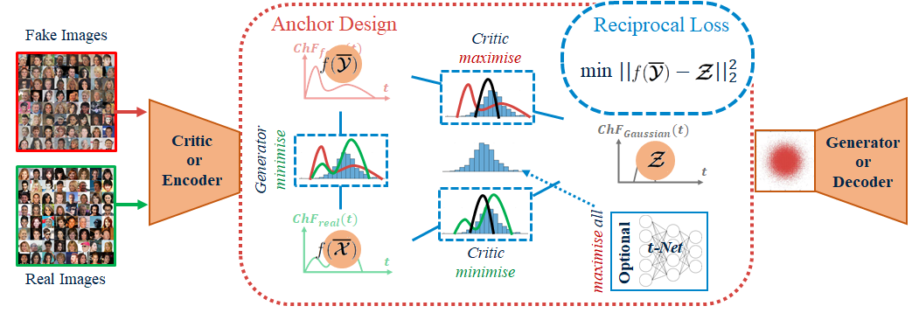
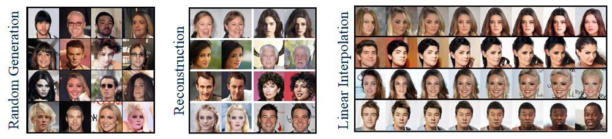
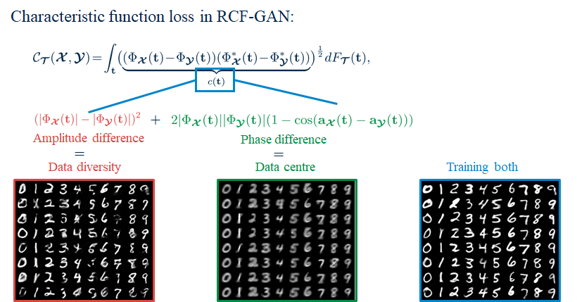

# RCF-GAN
This code is for the implementation of RCF-GAN proposed in the paper "[Reciprocal Adversarial Learning via Characteristic Functions](https://arxiv.org/abs/2006.08413)" that has been accepted as Spotlight in NeurIPS 2020. 

RCF-GAN, with a reciprocal theorey, intrinsically combines an auto-encoder and GAN by only two neat modules, together with a simple yet stable training strategy:



The RCF-GAN with ResNet on 128x128 images



What can the characteristic function control in RCF-GAN?



## Requirements
Python, Pytorch and then ```pip install -r requirements.txt```

One GPU for most cases; Two GPUs for ResNet + 128x128 image size

## How to Use
You can run the following example command for (roughly) replicating results in the paper (due to randomness in sampling):
```
CUDA_VISIBLE_DEVICES=0 python main_parse.py --dataset cifar_train --img_size 32 --mark rcf-gan
```
Results for other dataset and settings can use the following relationships:

| #Commands | ```--dataset```\# | ```--img_size```\# | ```--z_dim``` | ```--net_model``` | ```--epochs``` |
|:---:|:---:|:---:|:---:|:---:|:---:|
| **cifar-10 dcgan** | cifar_train | 32 | 128* | dcgan* | 300* |
| **celeba dcgan** | celeba | 64 | 64 | dcgan* | 300* |
| **lsun_bedroom dcgan** | lsunb_train | 64 | 128* | dcgan* | 500 |
| **celeba resnet 64** | celeba | 64 | 64 | resnet | 300* |
| **lsun_bedroom resnet 64** | lsunb_train | 64 | 128* | resnet | 300* |
| **celeba resnet 128** | celeba | 128 | 64 | resnet | 300* |
| **lsun_bedroom resnet 128** | lsunb_train | 128 | 128* | resnet | 300* |

(* means the default and \# for the required things)

Other commands that you might use
```
    '--t_net', type=int, default=64, help='0 to disable t_net.'
    '--bs', type=int, default=64, help='Batch sizes for all.'
    '--alpha', type=float, default=0.5, help='Alpha weight of the amplitude in CF loss.'
    '--lr', type=float, default=2e-4, help='Learning rate.'
    '--resume_training', type=int, default=0, help='Whether to resume training; positive numbers for resuming epochs; negative number for evaluation only.')
    '--save_period', type=int, default=10, help='A period to save checkpoint.'
```

You could find more adjustable parameters in *main_parse.py* for your own experiments.

OR you can directly run main_xxx_xxx.py in ./main_files for each setting we used in the paper. You just need to copy them in the root directory and run those.
## Directories
* Dataset preparation:
    * For cifar-10 dataset (automatically downloaded): ./data/cifar-10
    * For celeba: ./data/img_align_celeba/img_align_celeba/ \*.png
    * For lsun_bedroom (download by refering to [this](https://github.com/fyu/lsun)): ./data/bedroom_train_lmdb/ \*.mdb
* Automatically created output directories:
    * ./model:  checkpoints and final model
    * ./results: middle visualisations and final images
    * ./runs: information for tensorboardX
    
## To Do
- [x] cfgan_model.py: Add data parallel module

- [ ] clean everything up and standardise code comments

## Terms of Use
The code is provided for research purposes only and without any warranty. Any commercial use is prohibited.
 When using the code in your research work, you should cite the following paper:

``` Shengxi Li, Zeyang Yu, Min Xiang, Danilo Mandic. Reciprocal Adversarial Learning via Characteristic Functions. arXiv preprint arXiv:2006.08413, 2020.```

## Acknowledgements
* Our evaluation codes in ./metrics on FID and KID scores were almost fully adapted from [abdulfatir/gan-metrics-pytorch](https://github.com/abdulfatir/gan-metrics-pytorch);
* Our ResNet.py were developed from [jalola/improved-wgan-pytorch](https://github.com/jalola/improved-wgan-pytorch/blob/master/models/wgan.py);
* We also appreciated [igul222/improved_wgan_training](https://github.com/igul222/improved_wgan_training) for providing net structure details on ResNet structures.